#  Cheesegang App

**Cheesegang: is a modern Food Delivery Application i built  it with Flutter, focusing on a smooth user experience and high performance.

---

##  Features

* **Beautiful UI:** Clean and interactive burger delivery interface.
* **State Management:** Powered by **Bloc/Cubit** for efficient and predictable state handling.
* **Local Storage:** Uses **Hive** for fast local data caching 
* **Network Layer:** Built with **Dio** and Clean API service architecture.

---

## 🛠️ Tech Stack & Architecture

* **Framework:** [Flutter](https://flutter.dev)
* **State Management:** [Flutter Bloc / Cubit](https://pub.dev/packages/flutter_bloc)
* **Database:** [Hive](https://pub.dev/packages/hive)
* **API Client:** [Dio](https://pub.dev/packages/dio)
* **Navigation:** Custom App Navigator.
* **Pattern:** Clean Architecture (Core, Features, Shared).

---

##  Project Structure Highlights
* `lib/core`: Network, Navigation, Utilities, and Constants.
* `lib/features`: Distinct modules like Auth, Home, Cart, and Product Details.
* `lib/shared`: Reusable widgets used across the app.

---

## 📸 Screenshots

  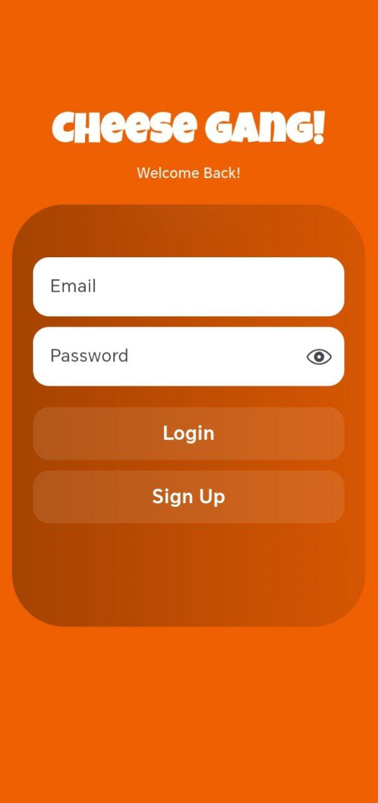
   
  <i>Login- Interactive 3D Burgers & Categories</i>

  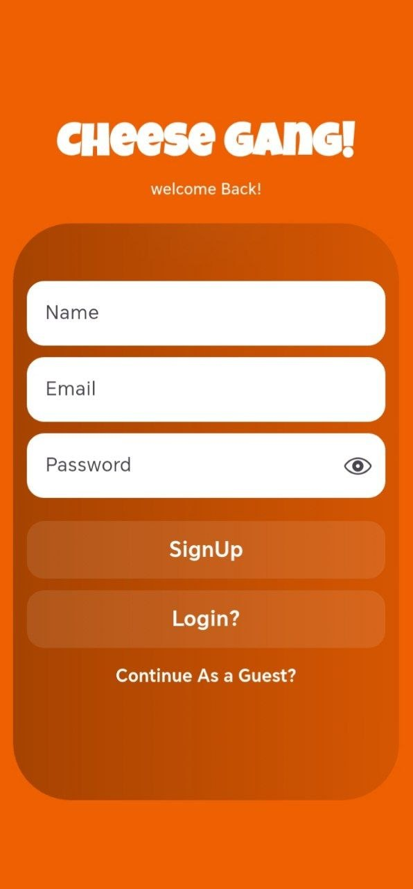
   
  <i>SignUp - Interactive 3D Burgers & Categories</i>

  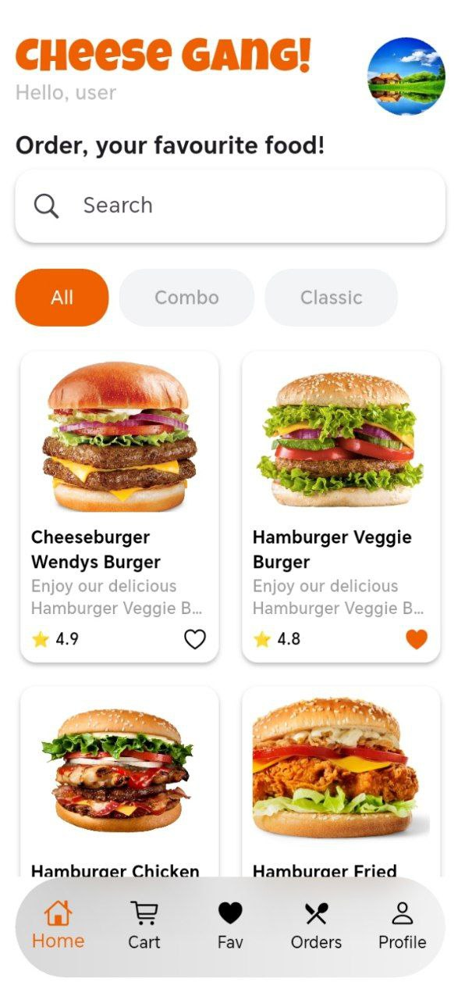
   
  <i>Home Screen - Interactive 3D Burgers & Categories</i>

  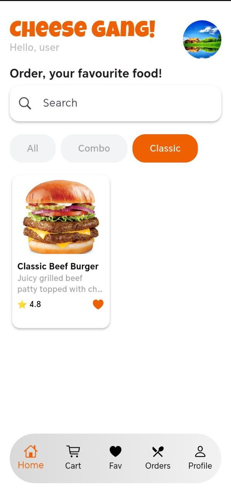
   
  <i>FilterCategories - Interactive 3D Burgers & Categories</i>

  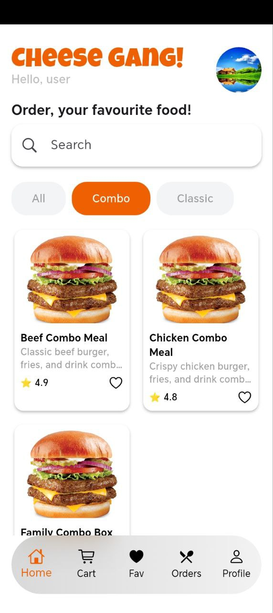
   
  <i>FilterCategories - Interactive 3D Burgers & Categories</i>

  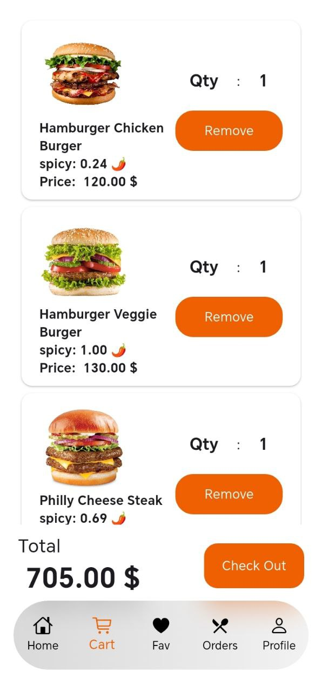
   
  <i>My Cart - Real-time Price Calculation</i>

  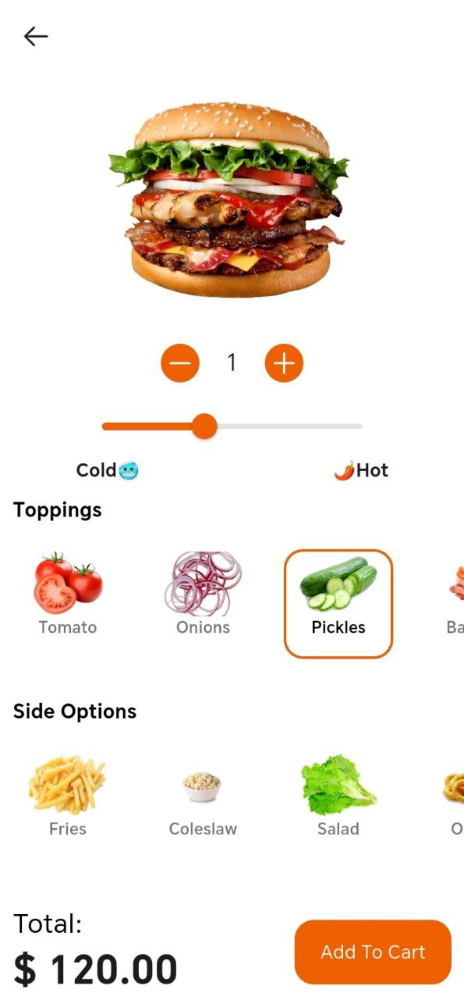
   
  <i>Product Details - Custom Toppings & Options</i>

  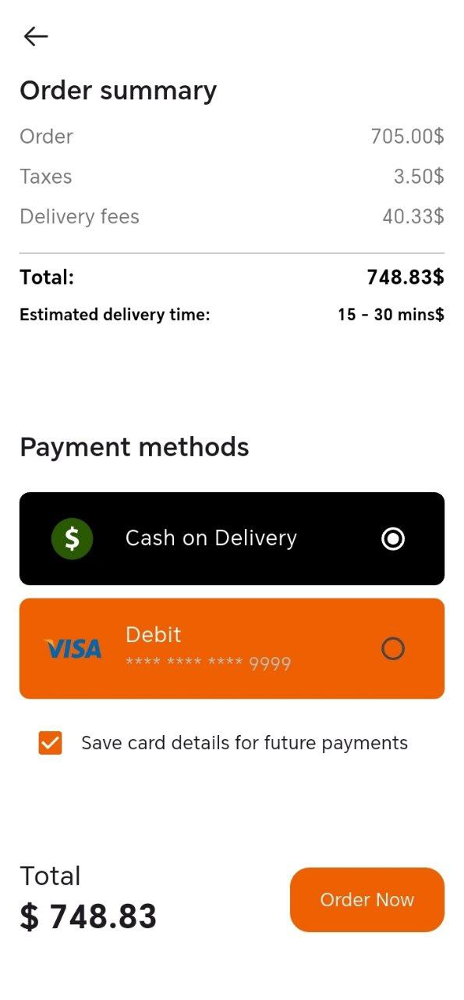
   
  <i>CheckOut - Real-time Price Calculation</i>

  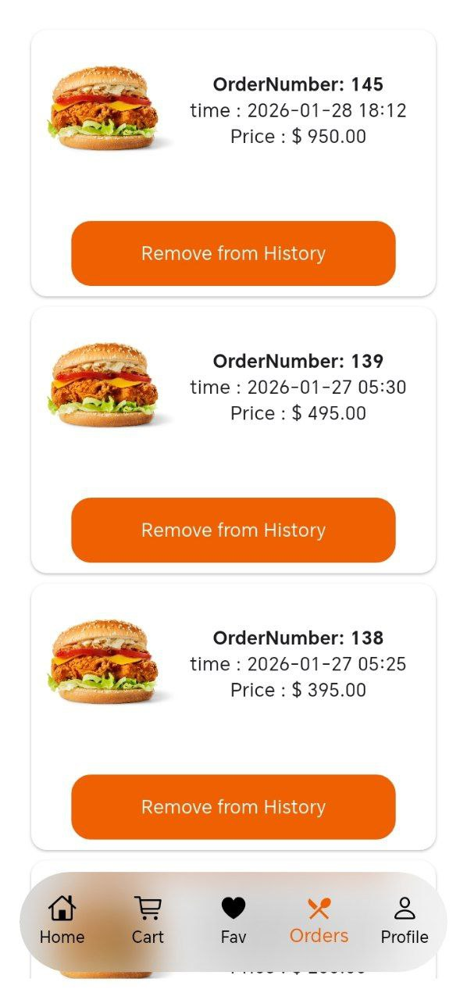
   
  <i>Order History - Optimistic Local Deletion</i>

 

  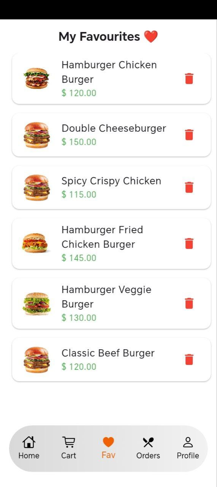
   
  <i>Favourites - Optimistic Local Deletion</i>

 

  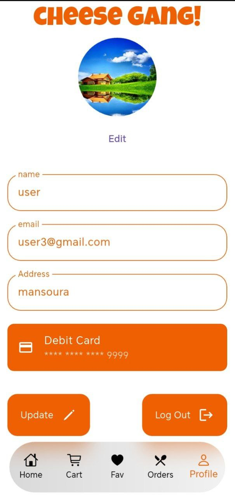
   
  <i>Profile - Optimistic Local Deletion</i>

 

---

##  Author
**Mahmoud Yasser** Flutter Developer

---
   